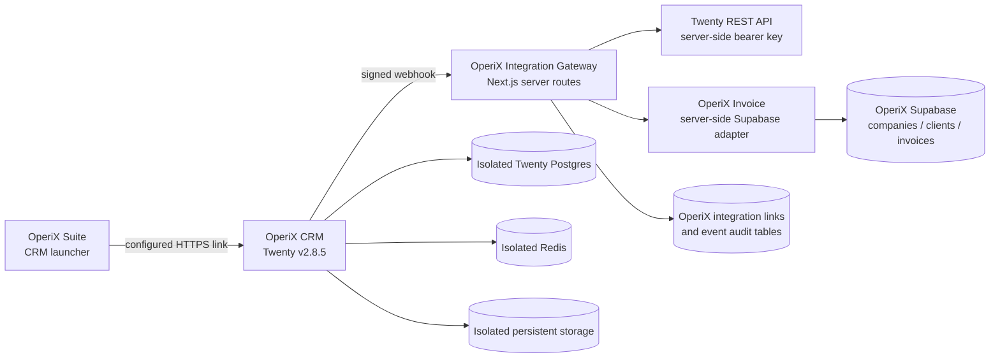

# OperiX CRM overview

OperiX CRM is a first-party OperiX product built around a self-hosted Twenty
deployment. Twenty owns CRM records; OperiX Invoice remains authoritative for
legal customers, invoices, payments, and accounting. The integration gateway
is server-side and stores only durable cross-application links and operational
events in the OperiX Supabase database.

## Boundaries

- No iframe, cookie sharing, token forging, or browser-side Twenty admin key.
- Twenty services run in their own Compose project, volumes, network, and
  backups. Their tables never enter OperiX Invoice/Supabase.
- CRM URL and launcher visibility are build-time public configuration in the
  Suite. Integration credentials are server-only Invoice environment values.
- All inbound webhooks require HMAC verification, bounded timestamps, valid
  organization context, and idempotency.

## Current release flags

All integration flags are false by default. Enable them one at a time in
staging, beginning with webhook receipt and link-only behavior. Automatic draft
financial records are intentionally not implemented in this release.

## Upgrade boundary

Twenty is treated as an upstream-backed controlled customization. Keep OperiX
branding/configuration in the `operix/main` customization layer and merge
tested upstream tags through an upgrade branch; do not scatter branding edits
through generated or core files.
