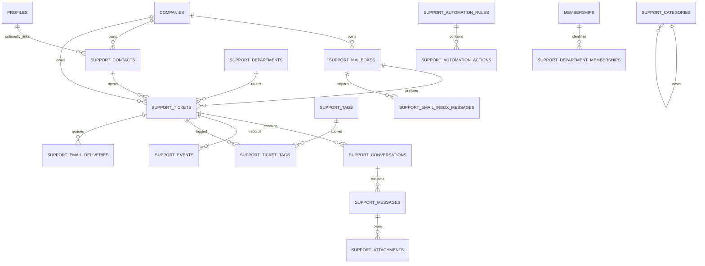
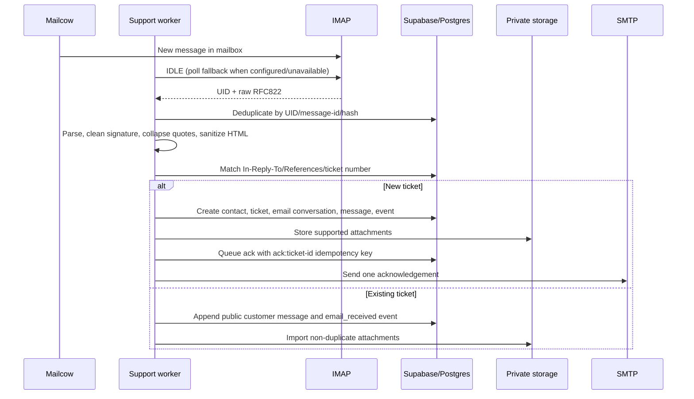
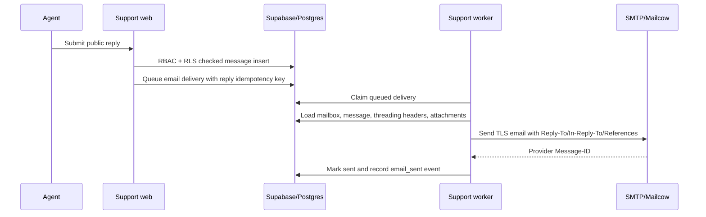
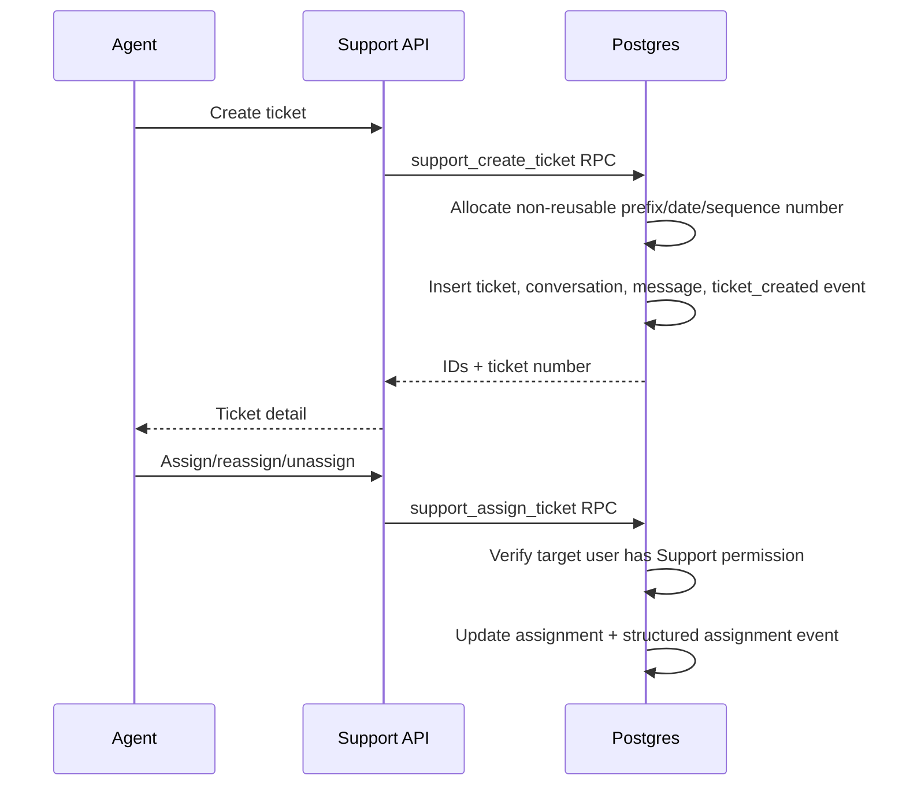

# ER and sequence diagrams

## ER diagram

```mermaid
erDiagram
  COMPANIES ||--o{ SUPPORT_MAILBOXES : owns
  COMPANIES ||--o{ SUPPORT_CONTACTS : owns
  COMPANIES ||--o{ SUPPORT_TICKETS : owns
  SUPPORT_MAILBOXES ||--o{ SUPPORT_TICKETS : prefixes
  SUPPORT_DEPARTMENTS ||--o{ SUPPORT_TICKETS : routes
  SUPPORT_CATEGORIES ||--o{ SUPPORT_CATEGORIES : nests
  SUPPORT_CONTACTS ||--o{ SUPPORT_TICKETS : opens
  SUPPORT_TICKETS ||--o{ SUPPORT_CONVERSATIONS : contains
  SUPPORT_CONVERSATIONS ||--o{ SUPPORT_MESSAGES : contains
  SUPPORT_MESSAGES ||--o{ SUPPORT_ATTACHMENTS : owns
  SUPPORT_TICKETS ||--o{ SUPPORT_EVENTS : records
  SUPPORT_TICKETS ||--o{ SUPPORT_TICKET_TAGS : tagged
  SUPPORT_TAGS ||--o{ SUPPORT_TICKET_TAGS : applied
  SUPPORT_TICKETS ||--o{ SUPPORT_EMAIL_DELIVERIES : queues
  SUPPORT_MAILBOXES ||--o{ SUPPORT_EMAIL_INBOX_MESSAGES : imports
  SUPPORT_AUTOMATION_RULES ||--o{ SUPPORT_AUTOMATION_ACTIONS : contains
  PROFILES ||--o{ SUPPORT_CONTACTS : optionally_links
  MEMBERSHIPS ||--o{ SUPPORT_DEPARTMENT_MEMBERSHIPS : identifies
```

## New email

```mermaid
sequenceDiagram
  participant M as Mailcow
  participant W as Support worker
  participant I as IMAP
  participant DB as Supabase/Postgres
  participant S as Private storage
  participant SMTP as SMTP
  M->>I: New message in mailbox
  W->>I: IDLE (poll fallback when configured/unavailable)
  I-->>W: UID + raw RFC822
  W->>DB: Deduplicate by UID/message-id/hash
  W->>W: Parse, clean signature, collapse quotes, sanitize HTML
  W->>DB: Match In-Reply-To/References/ticket number
  alt New ticket
    W->>DB: Create contact, ticket, email conversation, message, event
    W->>S: Store supported attachments
    W->>DB: Queue ack with ack:ticket-id idempotency key
    W->>SMTP: Send one acknowledgement
  else Existing ticket
    W->>DB: Append public customer message and email_received event
    W->>S: Import non-duplicate attachments
  end
```

## Agent reply

```mermaid
sequenceDiagram
  participant A as Agent
  participant WEB as Support web
  participant DB as Supabase/Postgres
  participant W as Support worker
  participant SMTP as SMTP/Mailcow
  A->>WEB: Submit public reply
  WEB->>DB: RBAC + RLS checked message insert
  WEB->>DB: Queue email delivery with reply idempotency key
  W->>DB: Claim queued delivery
  W->>DB: Load mailbox, message, threading headers, attachments
  W->>SMTP: Send TLS email with Reply-To/In-Reply-To/References
  SMTP-->>W: Provider Message-ID
  W->>DB: Mark sent and record email_sent event
```

## Ticket creation and assignment

```mermaid
sequenceDiagram
  participant U as Agent
  participant API as Support API
  participant DB as Postgres
  U->>API: Create ticket
  API->>DB: support_create_ticket RPC
  DB->>DB: Allocate non-reusable prefix/date/sequence number
  DB->>DB: Insert ticket, conversation, message, ticket_created event
  DB-->>API: IDs + ticket number
  API-->>U: Ticket detail
  U->>API: Assign/reassign/unassign
  API->>DB: support_assign_ticket RPC
  DB->>DB: Verify target user has Support permission
  DB->>DB: Update assignment + structured assignment event
```
